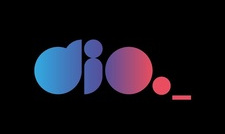

<h1 align="center">
  
</h1>

  <a href="#-projeto">Projeto</a>&nbsp;&nbsp;&nbsp;|&nbsp;&nbsp;&nbsp;
  <a href="#-tecnologias">Tecnologias</a>
 

 

## 
<b>Login Instagram</b>

 

  

 

## 💻 Projeto

O "Login Instagram" faz parte do projeto do "Módulo II - Fundamentos Web com HTML e CSS" do BootCamp Impulso Javascript Evolution ofertado pela Digital Innovation One o qual procura exercitar o HMTL e CSS bem como o FlexBox, no projeto é recriada a página inicial do Instagram para o primeiro acesso.

 

## ✨ Tecnologias

Esse projeto foi desenvolvido com as seguintes tecnologias:

- HTML
- CSS (FlexBox)

---
